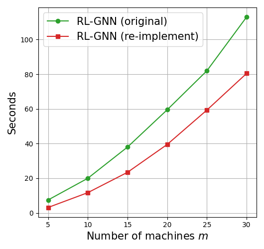
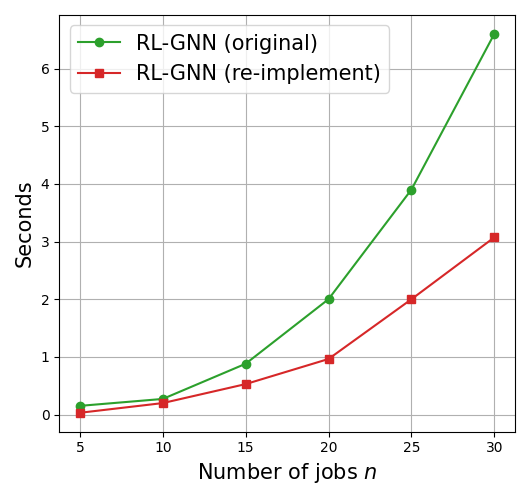

# Reimplement of Paper: "Learning to schedule job-shop problems: representation and policy learning using graph neural network and reinforcement learning"


```
@article{park2021learning,
  title={Learning to schedule job-shop problems: representation and policy learning using graph neural network and reinforcement learning},
  author={Park, Junyoung and Chun, Jaehyeong and Kim, Sang Hun and Kim, Youngkook and Park, Jinkyoo},
  journal={International Journal of Production Research},
  volume={59},
  number={11},
  pages={3360--3377},
  year={2021},
  publisher={Taylor \& Francis}
}
```

## Installation
python 3.9.9

CUDA 11.3

pytorch 1.10.1
```commandline
pip3 install torch==1.10.1+cu113 torchvision==0.11.2+cu113 torchaudio===0.10.1+cu113 -f https://download.pytorch.org/whl/cu113/torch_stable.html
```

[PyG](https://github.com/pyg-team/pytorch_geometric) 2.0.2


Then install dependencies:
```
pip install --upgrade pip
pip install torch-scatter==2.0.9 -f https://pytorch-geometric.com/whl/torch-1.10.0+cu113.html
pip install torch-sparse==0.6.12 -f https://pytorch-geometric.com/whl/torch-1.10.0+cu113.html
pip install torch-geometric==2.0.2
pip install ortools==9.0.9972
pip install plotly==5.5.0
pip install networkx==2.6.3
pip install matplotlib==3.5.1
```
The environment is based on their [code](https://github.com/Junyoungpark/pyjssp)

## Progress
- [x] Environment rollout using random policy
- [x] Reimplementation of GNN in the original paper
- [x] Rollout the environment using GNN with sampled actions <br />
**(You can get running time for different problem sizes now, see below.)**
- [ ] Training code


## Use code
### Test rollout with random policy computes the correct makespan
Adjust the parameters in `verify_rollout.py`. Instances is randomly generated w.r.t the given size.
```buildoutcfg
if __name__ == "__main__":
    np.random.seed(1)
    verify_env(10, 10)  # adjust which size you want to verify (num_machine, num_job)
```
run
```
python3 verify_rollout.py
```
### Rollout with GNN
Adjust the parameters in `rollout.py`. Instances is randomly generated w.r.t the given size.
```buildoutcfg
if __name__ == "__main__":
    random.seed(0)
    numpy.random.seed(1)
    torch.manual_seed(1)

    dev = 'cuda' if torch.cuda.is_available() else 'cpu'
    s = Simulator(20, 100, verbose=False)  # adjust which size you want to rollout (num_machine, num_job)
    embed = RLGNN()
    policy = PolicyNet()
    rollout(s, dev, embed, policy)
```
run
```
python3 rollout.py
```
### Run Time Compare with Original Paper
#### For fixed number of jobs = 30

#### For fixed number of machines = 5


